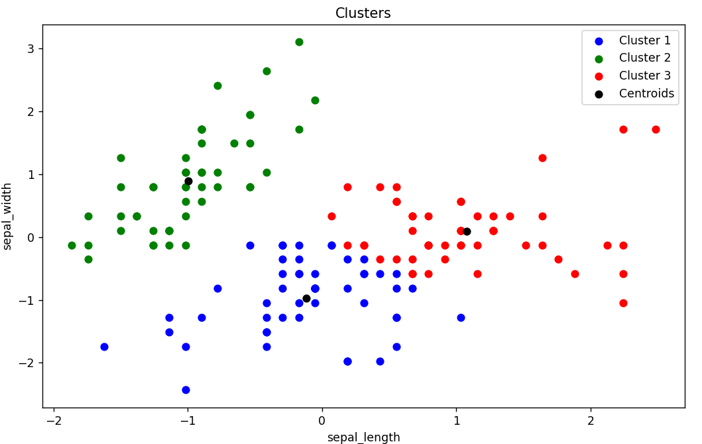

# K-Means Clustering

For an example of this algorithm, I used the:
- [Heart Attack Analysis & Prediction Dataset](https://www.kaggle.com/datasets/rashikrahmanpritom/heart-attack-analysis-prediction-dataset)

Please ensure that you have preprocessed the target variable to numeric (for example: 1, 2, 3) and changed the path to the dataset in [main.cpp](main.cpp).

I used 3 clusters on only 2 independent variables because it’s really hard (or impossible) to visualize 3D or higher dimensions. Additionally, I copied the given centroids and pasted them into Python because there are better and easier tools for visualization there.

