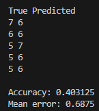

# K-Nearest Neighbor
 
For an example of this algorithm, I used the:
- [Red Wine Quality](https://www.kaggle.com/datasets/uciml/red-wine-quality-cortez-et-al-2009)

Please ensure that you have changed the path to the dataset in [main.cpp](main.cpp).

This dataset provides information about wines and their quality. The problem can be considered as both a classification and a regression problem. Because the dataset is very simple, I just standardized all independent variables and trained the algorithm using k_neighbors=3.

Looking from the classification perspective, this algorithm doesn’t work well because it only achieved 40% accuracy. However, if we look from the regression perspective, I would say that it did a great job because its error is only 0.68. 

Given that the wine quality rating ranges from 0 to 10, the worst-case error would be 5, which would represent a 100% error. However, our model has an error of only 0.68. This means that our model’s error rate is less than 14% (0.68/5).