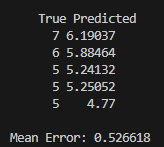

# Linear Reggresion
 
For an example of this algorithm, I used the:
- [Red Wine Quality](https://www.kaggle.com/datasets/uciml/red-wine-quality-cortez-et-al-2009)

Please ensure that you have changed the path to the dataset in [main.cpp](main.cpp).

Similar to the KNN algorithm, all we need to do is standardize the independent variables and train the algorithm.

Given that the wine quality rating ranges from 0 to 10, the worst-case error would be 5, which would represent a 100% error. However, our model has an error of only 0.52. This means that our model’s error rate is less than 11% (0.52/5), which is slightly better than the KNN model.