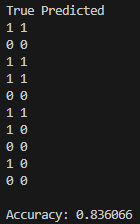

# Logistic Reggresion
 
For an example of this algorithm, I used the:
- [Heart Attack Analysis & Prediction Dataset](https://www.kaggle.com/datasets/rashikrahmanpritom/heart-attack-analysis-prediction-dataset)

Please ensure that you have changed the path to the dataset in [main.cpp](main.cpp).

This dataset contains some categorical variables, so the first step is to create dummy variables for each categorical variable and standardize the other variables. After that, the process is the same: split the dataset, train the model, and evaluate.

On validation data Logistic Reggresion achieved above 83% accuracy, which is pretty good.