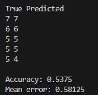

# Naive Bayes
 
For an example of this algorithm, I used the:
- [Red Wine Quality](https://www.kaggle.com/datasets/uciml/red-wine-quality-cortez-et-al-2009)

Please ensure that you have changed the path to the dataset in [main.cpp](main.cpp).

Everything is pretty much the same as with other algorithms using this dataset. Standardize variables, split the data, train, and evaluate.

From a regression problem perspective, an error of 0.58 is very good, and it’s better than the KNN algorithm. From a classification perspective, it’s not as good, but it’s slightly better than KNN.