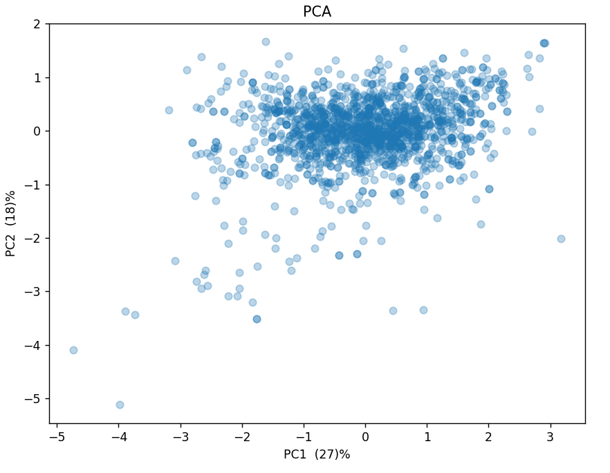

# Principal Component Analysis
 
For an example of this algorithm, I used the:
- [Red Wine Quality](https://www.kaggle.com/datasets/uciml/red-wine-quality-cortez-et-al-2009)

Please ensure that you have changed the path to the dataset in [main.cpp](main.cpp).

PCA is a powerful algorithm used for dimensionality reduction. It transforms the given data into a new coordinate system by maximizing the variance on the principal components. One of the greatest assets of PCA is its interpretability. Visualizing high-dimensional data can be challenging, so for the purpose of this demonstration, we’ve chosen to focus on the two principal components with the highest variance.

The scatter plot above represents our dataset projected onto these two principal components. Interestingly, these two components alone capture 46% of the total variance in the dataset. This means that we’re able to retain almost half of the information from the entire dataset using just these two dimensions.